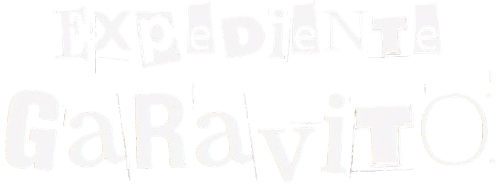

 

  

---

  A transmedia project documenting paranormal activity at the Escuela Colombiana de Ingeniería Julio   Garavito through interactive storytelling.

 

# 📄 Description

**Expediente Garavito** is a transmedia investigation that compiles evidence, testimonies, and audiovisual material about a series of alleged paranormal events occurring at the Escuela Colombiana de Ingeniería Julio Garavito. The narrative revolves around the legacy of the Colombian astronomer Julio Garavito and his supposed connection to these phenomena.

Through an immersive experience, the project invites the public to explore, interact, and draw their own conclusions about the reported events.

 

# 🖥 Preview
<video src="https://github.com/user-attachments/assets/c0b7e921-7850-4198-b169-ee87c58331d5" muted preload="auto" width="100%"></video>

 

# 🎯 Objective

To document, and present the paranormal phenomena reported by students and faculty, promoting discussion and community participation through a transmedia storytelling strategy.

 

> [!IMPORTANT]
> This project is intended for academic and creative purposes. The events described on the platform may contain fictional elements and should be interpreted with critical judgment.

 

# 🧩 Platform Components

- 🎙️ **Video podcasts**: Interviews and analyses with students.
- 📝 **Blog**: Users submitted personal stories and experiences.
- 🗺️ **Interactive map**: Geolocated events and occurrences.
- 📱 **Social media**: Short clips, discussions, and polls on TikTok, Instagram, YouTube, and Twitter.
- 🎧 **Podcast**: A series of episodes available on Spotify.

 

> [!NOTE]  
> The contributions and the code are in <b>English </b>. Neverthless, the content of this project (on live), the documentation, architecture and the thesis document are in <b>Spanish</b>. Make sure you can read and understand this language.

 

# 🧠 Transmedia Strategy

Expediente Garavito goes beyond a website by building a story across multiple digital platforms. Audience members can contribute their own stories, comment theories, and engage in conversations on social media.

> Inspired by productions like: *Archive 81 (Netflix)*, *Iker Jiménez Confidencial*, *Terrores Nocturnos*, and *Mausoleo de los Horrores*.

 

# 🛠️ Technologies Used

- React - Vite (Frontend)
- Express (Backend - API)
- Netlify (Client Hosting)
- Render (Server Hosting & Postgre Database)
- Spotify, YouTube, Instagram, TikTok, Twitter (content distribution)

 

# 🔗 Related Repositories

- 📦 **API Repository**: [Expediente Garavito Backend API](https://github.com/FazeElian/expediente-garavito-tnt-api)  
> This is the Express.js server that powers the platform's backend, including blog submissions and user stories.

 

## 👤 Authors

- Elián Ibarra (Developer & Designer)
- Daniel Díaz (Writer)

This project was created as a final assignment for the course **TNT - Transmedia Narrative Workshop**.

 

# 🎨 Design
For the creation of the User Interfaces (UI) design, we decided to use **Figma** as the mockups - wireframes tool.
 
  
Watch the Design clicking [here](https://www.figma.com/design/4MuuxcwEyWCfk5z2kAIVlP/Expediente-Garavito?node-id=0-1&t=KCp06lPGQjZ2Ony2-1)

 

# 🚀 Contributing

Pull requests are welcome. For major changes, please open an issue first
to discuss what you would like to change.

 
